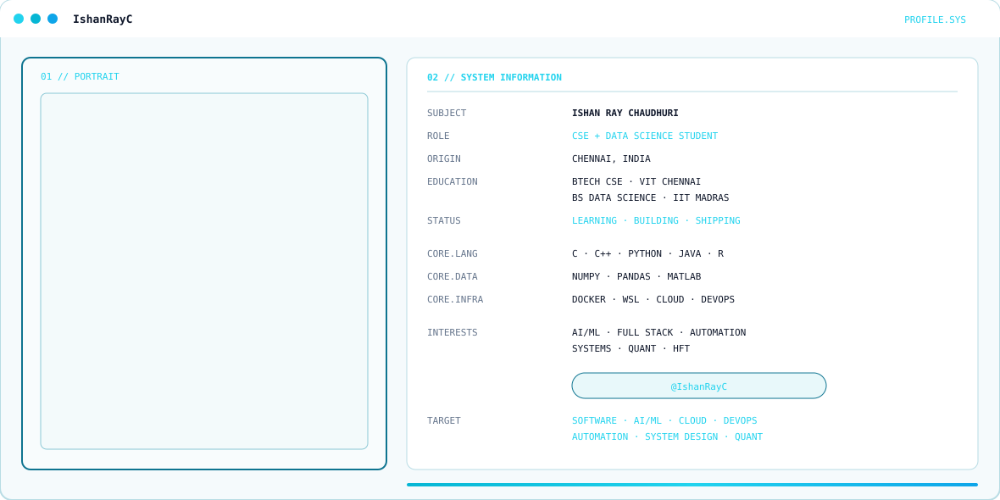

  <picture>
    <source media="(prefers-color-scheme: dark)" srcset="./assets/profile-hero-dark.svg">
    <source media="(prefers-color-scheme: light)" srcset="./assets/profile-hero-light.svg">
    
  </picture>

<!-- EXISTING NAME ANIMATION — intentionally unchanged -->

<b>BUILD → BREAK → DEBUG → LEARN → DEPLOY</b>

---

## ⚡ GitHub Activity

## 🐍 Contribution Activity

---

## 🚀 Projects

---

## 🧠 Areas of Interest

Software Engineering · AI/ML · Data Science · Quantitative Finance & HFT · Cloud & DevOps · Web Scraping · AI Automation

## 🛠️ Tech Stack

C · C++ · Python · Java · R · NumPy · Pandas · MATLAB · Docker · WSL · MySQL · Oracle · Figma · Canva · n8n

## 🎓 Education

**VIT Chennai** — B.Tech Computer Science & Engineering (Core)  
**IIT Madras** — BS Data Science

Keep learning. Keep building. Keep shipping.
