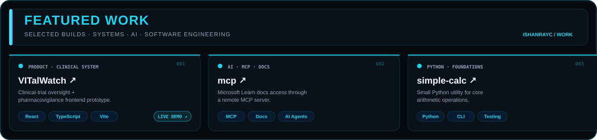

<table>
<tr>
<td width="42%" align="center" valign="middle">

</td>
<td width="58%" valign="middle">

<h3>02 // SYSTEM INFORMATION</h3>

<table>
<tr><td><b>SUBJECT</b></td><td><b>ISHAN RAY CHAUDHURI</b></td></tr>
<tr><td>ROLE</td><td>CSE + DATA SCIENCE STUDENT</td></tr>
<tr><td>ORIGIN</td><td>CHENNAI, INDIA</td></tr>
<tr><td>EDUCATION</td><td>BTECH CSE · VIT CHENNAI BS DATA SCIENCE · IIT MADRAS</td></tr>
<tr><td>STATUS</td><td>LEARNING · BUILDING · SHIPPING</td></tr>
<tr><td>CORE.LANG</td><td>C · C++ · PYTHON · JAVA · R</td></tr>
<tr><td>CORE.DATA</td><td>NUMPY · PANDAS · MATLAB</td></tr>
<tr><td>CORE.INFRA</td><td>DOCKER · WSL · CLOUD · DEVOPS</td></tr>
<tr><td>INTERESTS</td><td>AI/ML · FULL STACK · AUTOMATION SYSTEMS · QUANT · HFT</td></tr>
</table>

</td>
</tr>
</table>

<!-- EXISTING NAME ANIMATION — kept unchanged -->

<b>BUILD → BREAK → DEBUG → LEARN → DEPLOY</b>

---

## ⚡ GitHub Activity

  <picture>
    <source media="(prefers-color-scheme: dark)" srcset="./assets/profile-activity-dark.svg">
    <source media="(prefers-color-scheme: light)" srcset="./assets/profile-activity-light.svg">
    
  </picture>

---

## 🚀 Projects

  <picture>
    <source media="(prefers-color-scheme: dark)" srcset="./assets/projects-dark.svg">
    <source media="(prefers-color-scheme: light)" srcset="./assets/projects-light.svg">
    
  </picture>

---

## 🧠 Areas of Interest

Software Engineering · AI/ML · Data Science · Quantitative Finance & HFT · Cloud & DevOps · Web Scraping · AI Automation

## 🛠️ Tech Stack

C · C++ · Python · Java · R · NumPy · Pandas · MATLAB · Docker · WSL · MySQL · Oracle · Figma · Canva · n8n

## 🎓 Education

**VIT Chennai** — B.Tech Computer Science & Engineering (Core)  
**IIT Madras** — BS Data Science

Keep learning. Keep building. Keep shipping.

